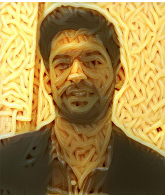
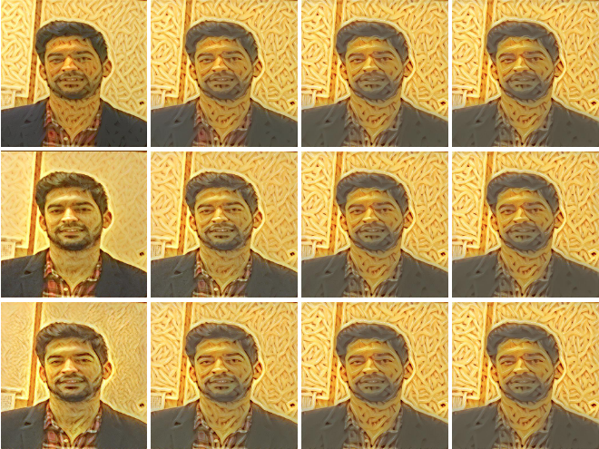
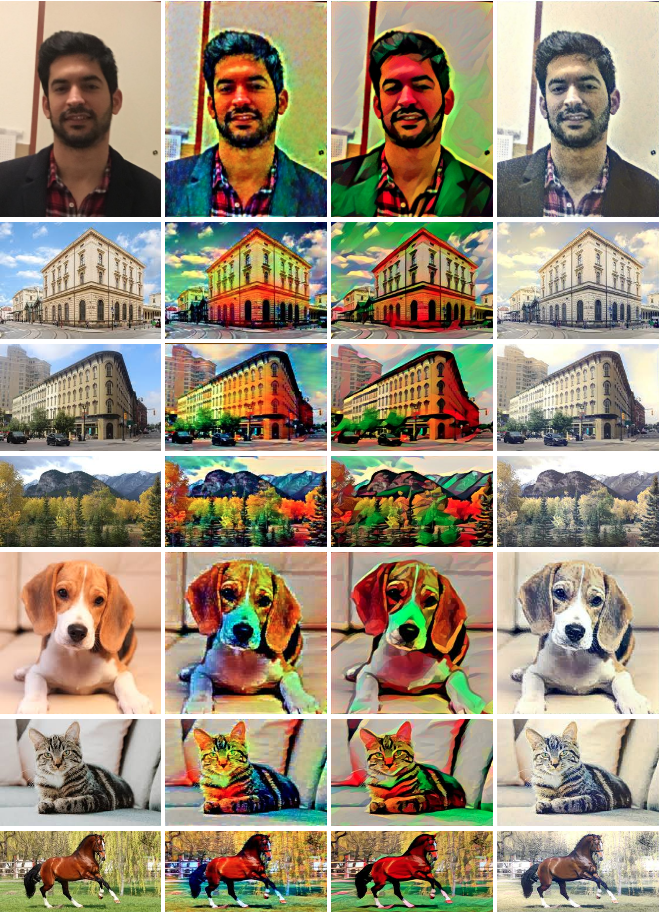

=======
Pastafy
=======

.. image:: https://img.shields.io/pypi/v/pastafy.svg
        :target: https://pypi.python.org/pypi/pastafy

.. image:: https://img.shields.io/travis/sfp932705/pastafy.svg
        :target: https://travis-ci.com/sfp932705/pastafy

.. image:: https://readthedocs.org/projects/pastafy/badge/?version=latest
        :target: https://pastafy.readthedocs.io/en/latest/?badge=latest
        :alt: Documentation Status

Pastafy anyone.

Ever pictured yourself in a pasta version? Maybe your puppy? Well now you can! Simply select a picture of yourself and a pasta style you may wish to apply.

* Free software: GNU General Public License v3
* Documentation: https://pastafy.readthedocs.io.

Features
--------

Pastafy brings artificial neural network style transfer from one image to another as described in `A Neural Algorithm of Artistic Style <https://arxiv.org/abs/1508.06576>`_.

Quick Use
---------

After installation process is complete, call pastafy from the command line. To see a list of available options type:

pastafy -h

  -h, - -help show this help message and exit

  -g GPU, - -gpu GPU Whether to use GPU or not. Defaults to False.

  -i IMG IMG, - -images IMG IMG Images to be used. First one should be the content image (you) and second one the style (kitty). Alternatively, you could specify any desired content and style.

  -n ITERS, - -number ITERS Number of iterations. Defaults to 10.

  -l LAYER, - -layer LAYER Feature layer to be extracted. Defaults to 4.

  -o OUTPUT, - -output OUTPUT Name of output image. Defaults to a concatenation of style image name and content image name.

  -r RATIO, - -ratio RATIO Ratio of the weights assigned to the style and content image (Alpha Beta ratio). Defaults to 0.01.

|
|

Running *pastafy -i me.jpeg images/pasta.jpg -n 10 -r 0.00001 -l 1* results in the following image:

|

Play around with the ratio values (keep low) and the feature layer to extract. The more iterations, the more style is applied to the image.
The following images are the results of different layer extractions (1,3,6), from top to bottom, and different ratios (0.001,  0.0001, 0.00001, 0.000001), from left to right.
Notice how the ratio and depth of the layer extracted from the network influence on the style Vs content control?

|

Alternatively, you could use pastafy to transfer styles from famous paintings to other images. Below are some results obtained. The original images are the left-most ones and different styles are applied to these.

Credits
-------

This package was created with Cookiecutter_ and the `audreyr/cookiecutter-pypackage`_ project template.

Inspired by the `Data Science Group <https://github.com/dsgiitr/Neural-Style-Transfer>`_.

.. _Cookiecutter: https://github.com/audreyr/cookiecutter
.. _`audreyr/cookiecutter-pypackage`: https://github.com/audreyr/cookiecutter-pypackage

